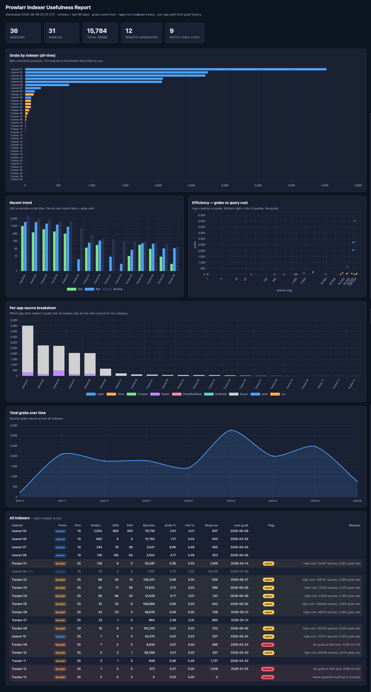

# prowlarr-indexer-report

A small live web service that turns Prowlarr's thin built-in stats into a
report you can act on: it ranks every indexer by **grabs**, shows **recent
trend**, exposes **query cost / failure / latency**, breaks grabs down by the
**consuming app** (Sonarr/Radarr/Lidarr/…), and **flags indexers that are safe
to disable** — so you can tell which of your indexers actually earn their keep.

The page is live: a background task re-queries Prowlarr on an interval and the
UI polls for the latest snapshot, so charts stay current without a reload.



## How it works

```
Prowlarr v1 API ──(every REFRESH_INTERVAL_MINUTES)──► background refresh
   ├─ GET /api/v1/indexer        (name, protocol, enable, priority)
   ├─ GET /api/v1/indexerstats   (grabs/queries/fails, all-time + 90d + 30d)
   └─ GET /api/v1/history        (per-grab events → per-app split + timeline)
                                          │
                                   cached report
                                          │
   browser ◄── GET /api/data (polled) ◄── FastAPI ── GET / (UI), /healthz
```

All Prowlarr calls are **read-only**. Grab counts (all-time / window / 30d) come
straight from `indexerstats`, which accepts `startDate`/`endDate`. The per-app
breakdown and the monthly timeline are reconstructed from grab history (the only
endpoint that records which app consumed each grab).

### History coverage

The report shows the **full grab history Prowlarr retains** — every page of
`/api/v1/history` is read (no client-side cap in practice), and `indexerstats`
totals match it because Prowlarr derives both from the same History table.
Prowlarr prunes that table at its `historycleanupdays` setting (default **365
days**), so "all-time" really means "all retained history": once an instance is
older than that window, the oldest day rolls off daily. The header shows the
actual span (`full history since <date>`), and a banner warns if paging ever hits
its safety cap so nothing is silently dropped.

### Removal heuristic

An enabled indexer is flagged:

- **remove** — never grabbed anything (pure query cost), or no grabs within the
  recent window (gone cold; the last-grab date is shown).
- **watch** — high query volume (≥5000) but a grab rate under 0.5% (lots of
  cost for little return).

Disabled indexers that never grabbed are noted but not counted as candidates.

## Quick start (Docker)

```yaml
services:
  prowlarr-indexer-report:
    image: ghcr.io/tikibozo/prowlarr-indexer-report:latest
    container_name: prowlarr-indexer-report
    environment:
      - PROWLARR_URL=http://prowlarr:9696
      - PROWLARR_API_KEY=<your-prowlarr-api-key>
      - WINDOW_DAYS=90
      - REFRESH_INTERVAL_MINUTES=15
    ports:
      - 8787:8787
    restart: unless-stopped
```

Open `http://<host>:8787`. The API key is in Prowlarr under
**Settings → General → API Key**.

## Configuration

| Env var | Default | Description |
|---|---|---|
| `PROWLARR_API_KEY` | *(required)* | Prowlarr API key. |
| `PROWLARR_URL` | `http://localhost:9696` | Base URL of the Prowlarr instance. |
| `WINDOW_DAYS` | `90` | Recent window for trend columns + removal heuristic. |
| `REFRESH_INTERVAL_MINUTES` | `15` | How often the service re-queries Prowlarr. |
| `HOST` / `PORT` | `0.0.0.0` / `8787` | Bind address/port for the web UI. |

## Endpoints

| Path | Purpose |
|---|---|
| `GET /` | Live report UI. |
| `GET /api/data` | Cached report as JSON. `503` until the first fetch completes. |
| `POST /api/refresh` | Force an out-of-band refresh (the UI's "Refresh now" button). |
| `GET /healthz` | Liveness; reports last success/error without failing on a transient Prowlarr outage. |

## Security

The web UI is **unauthenticated by design** — the report reveals which (often
private) trackers you use, so deploy it on a trusted network or behind your own
reverse proxy / SSO. The only secret is `PROWLARR_API_KEY`, read from the
environment and never logged. See [SECURITY.md](SECURITY.md).

## Development

```bash
uv sync --all-extras
uv run ruff check .
uv run pytest -q

# Run locally against a real Prowlarr:
PROWLARR_URL=http://localhost:9696 PROWLARR_API_KEY=... uv run uvicorn app.main:app --reload --port 8787
```

The analysis lives in `app/prowlarr.py`: `ProwlarrClient` does the async HTTP,
and `compute_report` is a pure function over the fetched payloads (which is what
the tests exercise). The UI is static (`app/static/`, Chart.js vendored).

## Releasing

Commits follow [Conventional Commits](https://www.conventionalcommits.org/).
release-please opens a release PR; merging it tags the version and the Release
workflow builds a Trivy-gated multi-arch image to
`ghcr.io/tikibozo/prowlarr-indexer-report`.

## License

[MIT](LICENSE)
